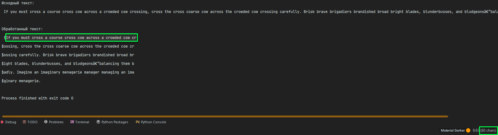
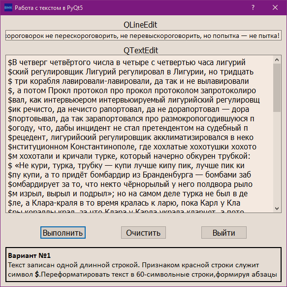

# BMK01_Text_Manipulations

## Современное кроссплатформенное программирование

### Лабораторная работа №4. Работа со строками

## ЗАДАНИЕ 4.1

Сделать консольную программу, которая загружает текст из файла, осуществляет заданный вариантом алгоритм и выводит
полученный результат на экран.

## ЗАДАНИЕ 4.2

Имеется текст в «QLineEdit» -компоненте (-ах). Данный текст необходимо преобразовать в соответствии с заданным в
варианте алгоритмом и результат поместить в другой «QLineEdit»-компонент или «QTextEdit» -компонент.

### Вариант №1

Текст записан одной длинной строкой. Признаком красной строки служит символ $. Переформатировать текст в 60-символьные
строки, формируя абзацы

## Консольный вариант

## Вариант с интерфейсом

